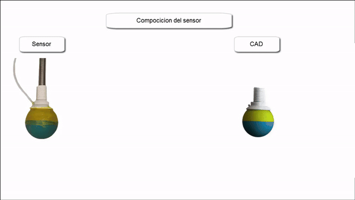

# Soft Paw Sensor for Tactile and Force Sensing in Legged Robots.
In this repository you can find the code and videos about the article “Soft Paw Sensor for Tactile and Force Sensing in Legged Robots” which is a sensor based on flexible conductive membranes, has the ability to simultaneously provide the position of the contact point and the force exerted.

## Abstract

The adaptability of legged robots to uneven terrain and their minimal ground impact have driven significant research advancements, establishing them as ideal solutions for complex and delicate environments. Proprioception and environmental perception are critical for enhancing robot performance, as they are essential for maintaining dynamic balance and achieving precise control. This paper presents a novel soft contact and force sensor designed for quadrupedal robot legs' pads (end effectors). The innovative soft sensitive paw, made from flexible conductive membranes, simultaneously measures force and contact point position, enabling environmentally aware decision-making. Experimental tests demonstrate its soft, spherical design provides excellent adaptability and grip on various terrains. Its sensing surface covers 83.3\% of the sphere’s area, with a measurement error of only 0.14\%. This capability allows the sensitive paw to detect ground contact and lateral and upper leg interactions, offering a robust and versatile tool for navigation and operation in complex environments.

The figure shows a graphical representation of different situations that could lead to a contact at the same position but in different situations, and the response of the proposed sensor. a) no contact, b) contact with a corner or wall, c) contact with a rigid surface, d) contact with a moving or flexible surface.

## Sensor structure and testing
### Sensor structure

### Operating Sensor

### Demonstration video on youtube

## Requerimets
The package is made for ROS Noetic, the development board is an arduino mega 2560 and the manometric pressure sensor is a Mps20n0040d with Hx710b.
## Content
### Project Overview  
The project code is located in the `ros_sensor_paw` folder.  

#### Arduino Code  
The `Arduino/sensor` folder contains the code for the Arduino Mega 2560 board:  
- **A0** and **A1**: Inputs for the latitude membrane.  
- **A2** and **A3**: Inputs for the longitude membrane.  
- **D4** and **D5**: Output and clock pins for the MPS20N0040D sensor with the HX710B chip.  

The collected data is published to the `/contacto_paw` topic.  

#### ROS Packages  
In the `catkin_ws/src` folder, two ROS Noetic packages are included:  

1. **`lec_sen`**  
   - Reads and publishes sensor data acquired by the Arduino board after adjusting the values.  
   - Data is published to the `/Sensor_contacto` topic.  

2. **`prom_lec_sen`**  
   - Filters the data of `/Sensor_contacto` using a Moving Average Filter to reduce noise.  
   - Processed data is published to the `/med_corr_sen` topic.  
  
## Reference
If this code is useful for you please consider citing our work appropriately. Thanks.

## Contact
For more questions, please feel free to contact us.

* hugoamj@gmail.com
* luisandresmj@gmail.com
* gerardo.flores@tamiu.com
